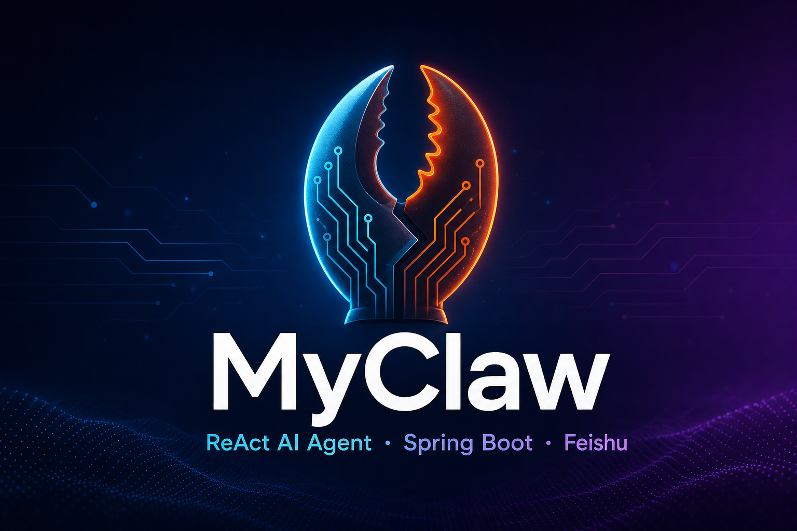
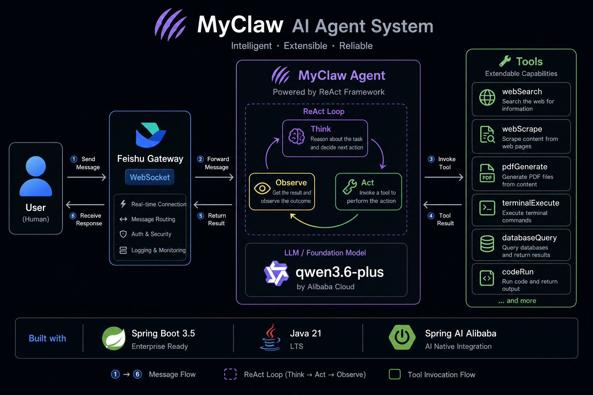
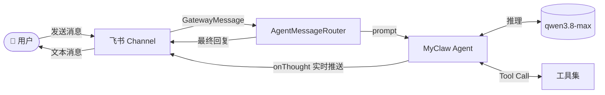
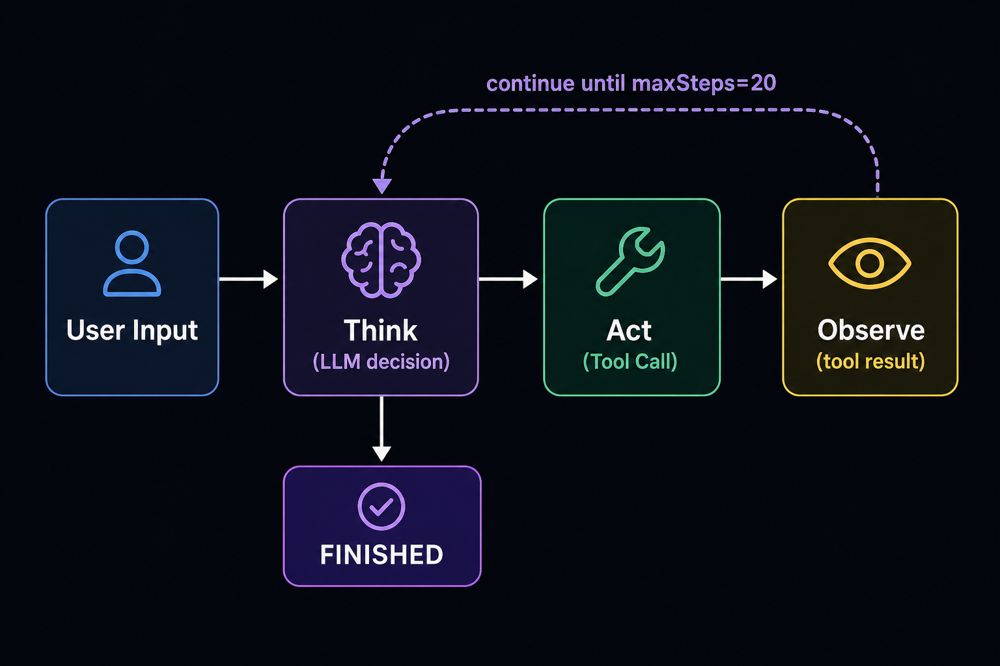
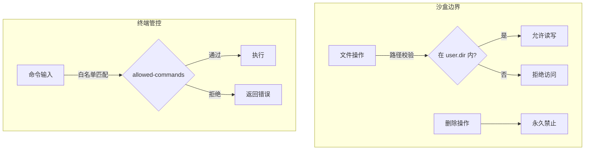

<p align="center">
  
</p>

<h1 align="center">MyClaw</h1>

<p align="center">
  基于 <strong>Spring Boot</strong> 与 <strong>Spring AI Alibaba</strong> 构建的全能型 ReAct AI Agent，<br/>
  支持联网搜索、网页抓取、文档生成、终端执行等丰富工具，并通过飞书 Gateway 与企业 IM 无缝集成。
</p>

<p align="center">
  
  
  
  
  
</p>

---

## ✨ 项目亮点

| 能力 | 说明 |
|------|------|
| 🧠 **ReAct 智能体** | 基于 Think → Act → Observe 循环，最多 20 步自主推理与工具调用 |
| 🔧 **11 种内置工具** | 搜索、抓取、下载、终端、文件、Office/PDF 文档生成等 |
| 💬 **飞书 Gateway** | WebSocket 长连接接入，支持多轮对话与实时思考推送 |
| 🌐 **Web 聊天界面** | 浏览器直连 Agent，SSE 流式展示思考过程与工具调用，支持 Markdown 与文档产物下载 |
| 🔒 **安全沙盒** | 文件操作限制在 `user.dir` 内，终端命令白名单管控 |
| 🌐 **跨平台** | 终端工具自动适配 Windows / Linux |
| 📖 **API 文档** | 集成 Knife4j，开箱即用的 Swagger UI |

---

## 🏗️ 系统架构

<p align="center">
  
</p>

消息从飞书（或未来扩展的其他 Channel）进入 Gateway，由 `AgentMessageRouter` 路由至 `MyClaw` Agent。Agent 在 ReAct 循环中调用 DashScope 大模型决策，按需触发工具执行，最终将结果回复给用户。



---

## 🔄 ReAct 执行循环

<p align="center">
  
</p>

Agent 每次收到用户消息后，进入如下循环，直到任务完成或达到步数上限：

1. **Think** — 调用大模型分析当前上下文，决定是否调用工具
2. **Act** — 执行模型选择的 Tool Call，获取执行结果
3. **Observe** — 将工具结果写入对话上下文，进入下一轮思考

当模型不再请求工具、调用 `terminate` 工具，或步数达到 `maxSteps`（默认 20）时，循环结束。

---

## 🛠️ 工具一览

| 工具 | 功能 | 底层依赖 |
|------|------|----------|
| `webSearch` | Tavily 联网搜索，返回结构化摘要与链接 | Tavily API |
| `wallpaperSearch` | 壁纸图片搜索 | HTTP |
| `webScrape` | 动态网页抓取，支持 JS 渲染 | Playwright |
| `resourceDownload` | 通过 URL 下载文件至 `tmp/file` | Hutool |
| `terminalExecute` | 白名单终端命令执行 | ProcessBuilder |
| `sandboxedFileOps` | 沙盒内读写文件（禁止删除） | Java NIO |
| `pdfGenerate` | HTML → PDF 文档生成 | Flying Saucer + OpenPDF |
| `wordGenerate` | Word (.docx) 文档生成 | Apache POI |
| `pptGenerate` | PPT (.pptx) 演示文稿生成 | Apache POI |
| `excelGenerate` | Excel (.xlsx) 表格生成 | Apache POI |
| `doTerminate` | 主动结束 Agent 交互 | — |

> 所有工具通过 Spring AI `@Tool` 注解声明，在 `ToolRegistration` 中统一注册。

---

## 📁 项目结构

```
myclaw/
├── src/main/java/com/lppnb/ai/myclaw/
│   ├── agent/                    # Agent 核心
│   │   ├── app/MyClaw.java       # 主 Agent 实例
│   │   ├── core/                 # BaseAgent → ReActAgent → ToolCallAgent
│   │   └── model/AgentState.java
│   ├── gateway/                  # 消息网关
│   │   ├── channel/              # Channel 抽象 & 消息路由
│   │   ├── feishu/               # 飞书 Channel 实现
│   │   └── web/                  # Web 聊天通道（认证 / SSE / 产物下载）
│   ├── tool/                     # Agent 工具集
│   │   ├── search/               # 联网搜索
│   │   ├── scrape/               # 网页抓取
│   │   ├── download/             # 资源下载
│   │   ├── terminal/             # 终端执行
│   │   ├── file/                 # 沙盒文件操作
│   │   ├── pdf|word|ppt|excel/   # 文档生成
│   │   └── ToolRegistration.java # 工具注册入口
│   └── MyclawApplication.java
├── src/main/resources/
│   └── application.yml           # 应用配置
├── web/                          # Web 前端工程（Vue 3 + Vite）
├── docs/images/                  # README 配图
└── openspec/                     # OpenSpec 规格与变更记录
```

---

## 🚀 快速开始

### 环境要求

- **JDK 21+**
- **Maven 3.9+**（或使用项目自带的 `mvnw`）
- **Node.js 20+**（构建 Web 前端页面需要）
- 阿里云 DashScope API Key（通义千问）
- Tavily API Key（联网搜索，可选）
- 飞书开放平台应用凭证（飞书接入，可选）

### 1. 克隆项目

```bash
git clone https://github.com/your-org/myclaw.git
cd myclaw
```

### 2. 配置环境变量

| 环境变量 | 说明 | 必填 |
|----------|------|------|
| `AI_DASHSCOPE_API_KEY` | 阿里云 DashScope API Key | ✅ |
| `TAVILY_API_KEY` | Tavily 搜索 API Key | 搜索功能需要 |
| `WEB_ACCESS_PASSWORD` | Web 聊天界面访问密码（与 `web.enabled=true` 配合启用） | Web 界面需要 |
| `FEISHU_APP_ID` | 飞书应用 App ID | 飞书接入需要 |
| `FEISHU_APP_SECRET` | 飞书应用 App Secret | 飞书接入需要 |

**Windows (PowerShell):**

```powershell
$env:AI_DASHSCOPE_API_KEY = "sk-xxxxxxxx"
$env:TAVILY_API_KEY = "tvly-xxxxxxxx"
$env:WEB_ACCESS_PASSWORD = "your-password"
$env:FEISHU_APP_ID = "cli_xxxxxxxx"
$env:FEISHU_APP_SECRET = "xxxxxxxx"
```

**Linux / macOS:**

```bash
export AI_DASHSCOPE_API_KEY=sk-xxxxxxxx
export TAVILY_API_KEY=tvly-xxxxxxxx
export WEB_ACCESS_PASSWORD=your-password
export FEISHU_APP_ID=cli_xxxxxxxx
export FEISHU_APP_SECRET=xxxxxxxx
```

### 3. 启动应用

```bash
# 1. 构建 Web 前端（首次或前端代码变更后）
cd web
npm install
npm run build
cd ..

# 2. 启动后端（Maven 会自动将 web/dist 产物复制进静态目录）
# Windows
.\mvnw.cmd spring-boot:run

# Linux / macOS
./mvnw spring-boot:run
```

启动成功后，服务运行在 `http://localhost:8080/api`。

### 4. 飞书机器人接入

1. 在 [飞书开放平台](https://open.feishu.cn/) 创建企业自建应用
2. 开启 **机器人** 能力，订阅 `im.message.receive_v1` 事件
3. 选择 **长连接（WebSocket）** 模式接收事件（无需公网回调地址）
4. 将 App ID / App Secret 配置到环境变量
5. 确保 `application.yml` 中 `gateway.feishu.enabled: true`
6. 在飞书群聊或私聊中 @机器人 即可开始对话

**对话命令：**

| 命令 | 说明 |
|------|------|
| 任意文本 | 与 Agent 多轮对话（保留上下文） |
| `/new` | 清空上下文，开启全新对话 |

### 5. Web 聊天界面

启用 `web.enabled=true` 并配置 `WEB_ACCESS_PASSWORD` 后，浏览器访问 `http://localhost:8080/api/` 即可进入 Web 聊天界面：

- 输入访问密码登录（HttpOnly cookie 会话，有效期 7 天）
- SSE 流式展示 Agent 思考过程与工具调用（ReAct 管线），最终回复按 Markdown 渲染、代码高亮
- Agent 生成的文档产物（PDF/Word/PPT/Excel）在回复中以可下载链接呈现
- 点击「新建会话」清空上下文；聊天历史保存在浏览器本地（刷新不丢）

> ⚠️ Web 与飞书通道共享同一 Agent 上下文：两端对话互相可见，「新建会话」会同时清空飞书上下文。

---

## ⚙️ 配置说明

核心配置位于 `src/main/resources/application.yml`：

```yaml
spring:
  ai:
    dashscope:
      api-key: ${AI_DASHSCOPE_API_KEY}

server:
  port: 8080
  servlet:
    context-path: /api

gateway:
  feishu:
    app-id: ${FEISHU_APP_ID}
    app-secret: ${FEISHU_APP_SECRET}
    enabled: true

tools:
  tavily:
    api-key: ${TAVILY_API_KEY}
  file:
    download-dir: ${user.dir}/tmp/file
  terminal:
    allowed-commands: echo,ls,dir,pwd,cat,grep,curl,java,mvn
```

| 配置项 | 默认值 | 说明 |
|--------|--------|------|
| `server.port` | `8080` | HTTP 服务端口 |
| `server.servlet.context-path` | `/api` | 应用上下文路径 |
| `gateway.feishu.enabled` | `true` | 是否启用飞书 Channel |
| `web.enabled` | `false` | 是否启用 Web 聊天通道（需同时配置访问密码） |
| `web.access-password` | — | Web 界面访问密码（`${WEB_ACCESS_PASSWORD}`） |
| `tools.file.download-dir` | `${user.dir}/tmp/file` | 下载文件存储目录 |
| `tools.terminal.allowed-commands` | 见上方 | 终端命令白名单 |

---

## 💬 使用示例

在飞书中与 MyClaw 对话，Agent 会自主选择合适的工具完成任务：

```
用户: 帮我搜索一下 Spring AI Alibaba 的最新版本，并整理成一份 Word 文档

MyClaw: [思考中...]
        → 调用 webSearch 搜索相关信息
        → 调用 wordGenerate 生成文档
        → 返回文档路径与摘要
```

```
用户: 抓取 https://example.com 的页面标题和正文

MyClaw: → 调用 webScrape（Playwright 渲染）
        → 返回结构化页面内容
```

```
用户: /new

MyClaw: 清空上下文成功！
```

---

## 🔒 安全设计



- **文件沙盒**：`sandboxedFileOps` 所有路径必须位于 `user.dir` 下，禁止 `delete` 操作
- **终端白名单**：仅允许配置列表中的命令，防止任意命令执行
- **凭证隔离**：API Key 通过环境变量注入，不硬编码在源码中

---

## 📚 API 文档

项目集成了 Knife4j，启动后访问：

| 地址 | 说明 |
|------|------|
| [http://localhost:8080/api/doc.html](http://localhost:8080/api/doc.html) | Knife4j 文档（中文） |
| [http://localhost:8080/api/swagger-ui.html](http://localhost:8080/api/swagger-ui.html) | Swagger UI |

---

## 🧪 运行测试

```bash
./mvnw test
```

---

## 🗺️ 技术栈

| 类别 | 技术 |
|------|------|
| 框架 | Spring Boot 3.5、Spring AI Alibaba Agent Framework |
| 大模型 | 阿里云 DashScope（qwen3.8-max） |
| IM 接入 | 飞书 oapi-sdk 2.5.3（WebSocket 长连接） |
| 搜索 | Tavily Search API |
| 网页抓取 | Microsoft Playwright |
| 文档生成 | Apache POI、Flying Saucer + OpenPDF |
| 工具库 | Hutool、Lombok |
| API 文档 | Knife4j 4.4 |

---

## 🤝 贡献

欢迎提交 Issue 和 Pull Request！新工具开发可参考 `openspec/` 目录下的规格说明，遵循 OpenSpec 变更流程。

---

## 📄 License

MIT License

---

<p align="center">
  <sub>Made with ❤️ by MyClaw Team</sub>
</p>
